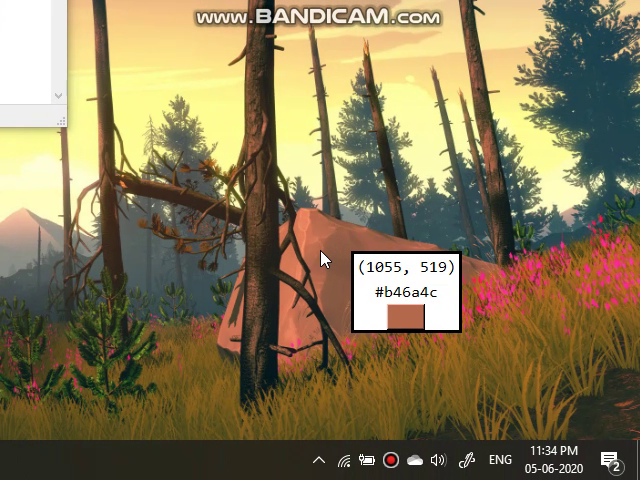
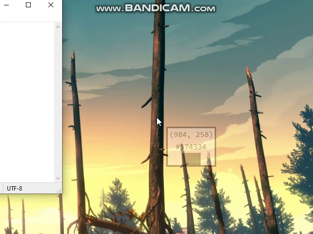

# PyColorPick

A python GUI script to pick pixel colors under the cursor position. A floating boderless GUI window moves with the cursor, displaying the current cursor position along with the color of the pixel (in hex format)

### Demonstration
#### A video demonstrating the program


#### A *unfaded* floating window
The floating window is on focus. Shortcuts will work.



#### A *faded* floating window
The shortcuts wont work, but still: this floating window will display the correct cursor position and color.




### Currently supported shortcuts
* ````Ctrl + C````: With the floating window active, this shortcut copies the pixel color's hexadecimal value to your clipboard
* ````Ctrl + D````: With the floating window active, this shortcut quits the program


### Usage
* Clone this repository
* Browse the cloned location
* Install dependencies: ````pip install -r requirements.txt````
* Run the script: ````python main.py````

### Notes
This project was created and tested under Windows, and is expected to work fully in other systems too.

This project is still under development. Parts of the source codes may not be well documented.
Also suitable prompts may not be available for the user at the moment.

More features and fixes are yet to come. Meanwhile suggestions, ideas, bug reports are welcomed.

I am a python n00bie! I am still learning python! I have tried my best to give in as much effort required (of course directly proportionate to my knowledge), for this project.

<br>***Kinjal Raykarmakar***